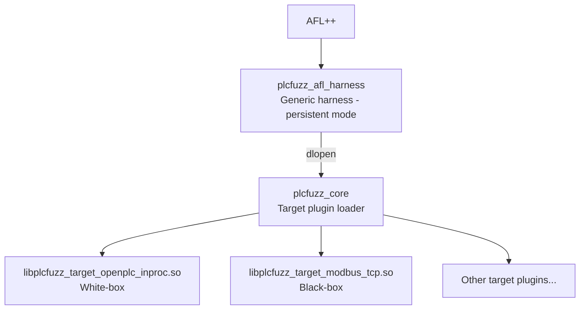

# plc-fuzzing

A coverage-guided fuzzing framework for PLC programs using AFL++.

The goal is to discover crashes, assertion failures, or unexpected behaviors in PLC logic by applying coverage-guided fuzzing techniques. The framework supports both **white-box** (instrumented targets) and **black-box** (network-based, non-instrumentable targets) fuzzing modes.

> **Prerequisites**: [Install AFL++](https://aflplus.plus/docs/install/) on your system.

## Quick Start

### White-box: OpenPLC in-process (full coverage)

```bash
./scripts/run_afl_openplc_inproc.sh
```

### Black-box: Modbus/TCP (network target)

```bash
./scripts/run_afl_modbus_tcp.sh
```

### Validate the setup (intentional crash)

```bash
OPENPLC_FUZZ_CRASH=1 ./scripts/run_afl_openplc_inproc.sh
```

This enables a test crash when `%MW0 == 0x1337`. The seed `in/mw0_1337.bin` triggers it, so AFL++ should find the crash within seconds.

## Architecture



The fuzzing engine is **target-agnostic**: it only does `bytes → run one test → outcome`. Targets are implemented as shared library plugins loaded via `dlopen()`.

### Key Components

| Component | Location | Description |
|-----------|----------|-------------|
| Target API | `plcfuzz/include/plcfuzz_target_api.h` | Plugin ABI (init/run/deinit, outcome, feedback) |
| Core loader | `plcfuzz/src/core.c` | Loads target plugins via dlopen |
| AFL++ harness | `plcfuzz/src/afl_harness.c` | Persistent-mode harness for AFL++ |
| OpenPLC plugin | `plcfuzz/targets/openplc_inproc/` | In-process target (white-box) |
| Modbus/TCP plugin | `plcfuzz/targets/modbus_tcp/` | Network target (black-box) |

## How It Works

### White-box Mode (Instrumentable Targets)

White-box fuzzing applies to any target where you can compile code with AFL++ instrumentation for coverage tracking. This includes:

- **OpenPLC in-process**: The included target plugin runs an instrumented OpenPLC program directly in the harness process.
- **Other instrumentable PLCs**: Physical or emulated PLCs where you can deploy instrumented firmware or runtime code.

For the OpenPLC in-process target specifically:

1. **Instrumentation**: Both the OpenPLC runtime and the compiled PLC program (`libplc_*.so`) are compiled with `afl-clang-fast` for coverage tracking.

2. **Execution**: The harness loads the PLC program via `dlopen()`, maps fuzzed bytes to PLC input memory (`%MW`, `%IX`), and executes one scan cycle per testcase.

3. **Determinism**: State is reset between iterations (timers, debug flags, input buffers, force flags) to achieve ~98% stability.

4. **Coverage**: `AFL_PRELOAD` ensures the dynamically loaded PLC library contributes to AFL++'s coverage map.

### Black-box Mode (Non-Instrumentable Targets)

Black-box fuzzing applies to targets where instrumentation is not possible—typically proprietary PLCs accessible only over a network protocol.

1. **No instrumentation required** on the target PLC—only the harness is instrumented.

2. **Network communication**: Fuzzed bytes are sent as Modbus register writes (function 0x10) to the target.

3. **Response classification**: Timeouts, disconnects, and exceptions are surfaced to AFL++ as crashes/hangs.

4. **Configuration**: Target address, port, registers, and timeouts are specified in a JSON config file.

## Input Format

Each target plugin defines its own input format. The harness pads with zeros if the testcase is shorter than the maximum. Use `AFL_MAX_LEN=<bytes>` to override the default cap.

**OpenPLC in-process** (max 20 bytes):
- **Bytes 0–15**: 8 little-endian 16-bit words → `%MW0..%MW7`
- **Bytes 16–19**: 4 bytes → `%IX0.0..%IX3.7` (32 input bits)

**Modbus/TCP** (max 128 bytes):
- **Bytes 0–N**: Little-endian 16-bit words written to configured holding registers

## Environment Variables

| Variable | Description |
|----------|-------------|
| `PLCFUZZ_TARGET_LIB` | Path to target plugin `.so` |
| `PLCFUZZ_TARGET` | Target name (e.g., `openplc_inproc`, `modbus_tcp`) |
| `PLCFUZZ_CONFIG` | Path to target config file (e.g., JSON for Modbus) |
| `PLCFUZZ_VERBOSE` | Set to `1` for verbose logging |
| `PLCFUZZ_ENABLE_TEST_CRASH` | Set to `1` to enable test crash trigger |
| `OPENPLC_BUILD_DIR` | Path to OpenPLC build directory (for in-process target) |
| `AFL_PRELOAD` | Path to instrumented `libplc_*.so` for coverage |

## Reproducing a Crash

To replay a saved crash outside of `afl-fuzz`:

```bash
# For OpenPLC in-process
LIBPLC="$(ls -1 openplc-runtime/build-afl/libplc_*.so | head -n 1)"
OPENPLC_BUILD_DIR="$(pwd)/openplc-runtime/build-afl" \
AFL_PRELOAD="$LIBPLC" \
  ./build-plcfuzz-afl/plcfuzz_afl_harness < out/default/crashes/id:000000*
```

## Seed Corpus

The `in/` directory currently only contains seed files designed for the **OpenPLC in-process target**. These seeds use the OpenPLC input format where the first two bytes map to `%MW0`:

| File | Description |
|------|-------------|
| `mw0_1337.bin` | `%MW0 = 0x1337` — triggers intentional crash (when enabled) |
| `mw0_0000.bin` | `%MW0 = 0x0000` — zero value |
| `mw0_ffff.bin` | `%MW0 = 0xFFFF` — max unsigned value |
| `mw0_7fff.bin` | `%MW0 = 0x7FFF` — max signed positive |
| `mw0_8000.bin` | `%MW0 = 0x8000` — min signed negative |
| `mixed_20.bin` | 20 bytes covering `%MW0..%MW7` and `%IX0..%IX3` |

For other targets (e.g., Modbus/TCP), you may need to create target-specific seed files matching that target's input format and register layout.

## Adding a New Target

1. Create a new directory under `plcfuzz/targets/<target_name>/`

2. Implement the target API:
   ```c
   #include "plcfuzz_target_api.h"
   
   static bool my_init(const plcfuzz_target_config_t *config, plcfuzz_target_ctx_t **ctx_out);
   static bool my_run(plcfuzz_target_ctx_t *ctx, const uint8_t *data, size_t len, plcfuzz_result_t *result);
   static void my_deinit(plcfuzz_target_ctx_t *ctx);
   
   static const plcfuzz_target_api_t g_my_api = {
       .abi_version = PLCFUZZ_TARGET_ABI_VERSION,
       .name = "my_target",
       .max_input_len = 128,
       .init = my_init,
       .run = my_run,
       .deinit = my_deinit,
   };
   
   const plcfuzz_target_api_t *plcfuzz_get_target_api(void) {
       return &g_my_api;
   }
   ```

3. Add the build target to `CMakeLists.txt`

4. Use with: `PLCFUZZ_TARGET_LIB=./build/targets/libplcfuzz_target_my_target.so`

## Test PLC Program (OpenPLC)

The included test project at `test-projects/TempControlPLC/` is designed for use with the **OpenPLC in-process target**. It implements a simple temperature control scenario:

**Variables:**

| Name | Type | Location | Description |
|------|------|----------|-------------|
| `Temp` | INT | `%MW0` | Temperature in tenths of °C |
| `FanCmd` | BOOL | `%QX0.0` | Cooling fan output |
| `HighT` | INT | — | High threshold (23.0°C) |
| `LowT` | INT | — | Low threshold (21.0°C) |

**Logic (Structured Text):**
```iecst
IF Temp >= HighT THEN
    FanCmd := TRUE;
ELSIF Temp <= LowT THEN
    FanCmd := FALSE;
END_IF;
```

> The seed corpus in `in/` is designed to exercise this program's input (`%MW0` for temperature).

## Build Details

The `scripts/run_afl_openplc_inproc.sh` script handles:

1. Building OpenPLC runtime with AFL++ instrumentation (`-DFUZZING=ON`)
2. Compiling the PLC program with `afl-clang-fast`
3. Building plcfuzz harness and target plugins
4. Setting `AFL_PRELOAD` for dlopen'd library coverage
5. Temporarily adjusting `/proc/sys/kernel/core_pattern` (requires sudo)
6. Running `afl-fuzz` with appropriate flags

Fuzz artifacts are isolated:
- OpenPLC build: `openplc-runtime/build-afl/`
- plcfuzz build: `build-plcfuzz-afl/`
- Output: `out/`
